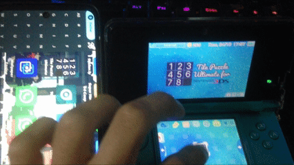

# Tile Puzzle Ultimate For 3DS

A tile puzzle game port for the Nintendo 3DS, built using Lua and homebrew development tools.

## Projects & Tools Used

- **[lpp-3ds (Lua Player Plus 3DS)](https://github.com/Rinnegatamante/lpp-3ds)** - A powerful homebrew interpreter that allows running Lua code on the Nintendo 3DS.
- **[Micro2D Engine](https://github.com/Sharper-Dev/Micro2D-Engine)** - My lightweight 2D game engine/framework developed in Lua for structuring and rendering 2D games.
- **[devkitPro](https://devkitpro.org/)** - Essential toolchain and utilities (`makerom`, `3dstool`) used for building Nintendo 3DS homebrew packages (`.3dsx` and `.cia`).
- **[Lua](https://www.lua.org/)** - The lightweight multi-paradigm programming language used for game logic and scripting.

## Gallery

- **Gameplay on 3DS:**

https://github.com/user-attachments/assets/9cff6bfa-4255-4120-8f9e-79d19a4031e8

- **Gameplay on Citra Emulator:**

https://github.com/user-attachments/assets/8b76fb58-a5d7-401f-82ab-72e3c16f3649
