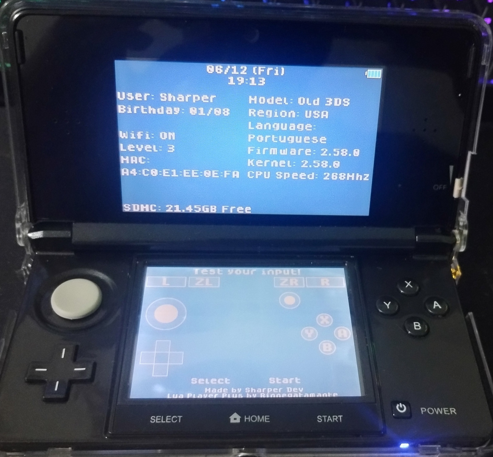
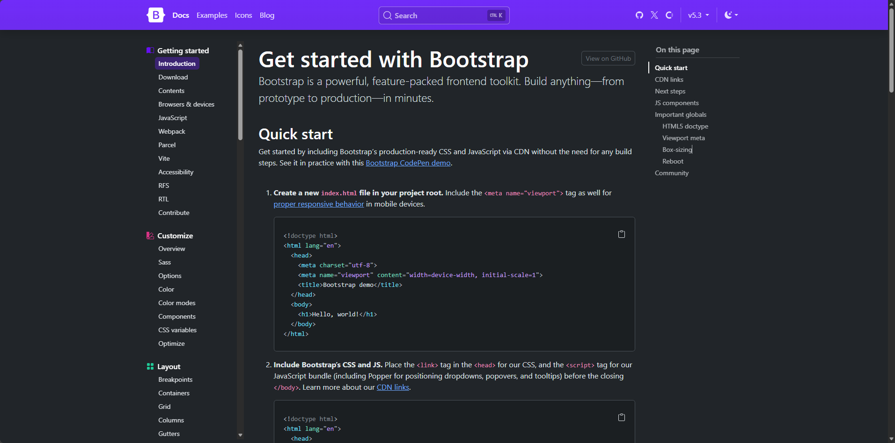
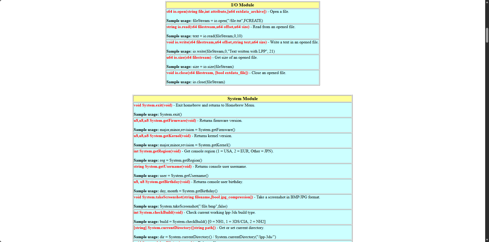
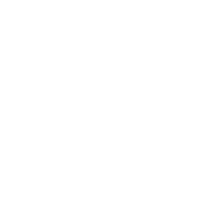
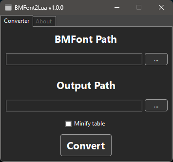
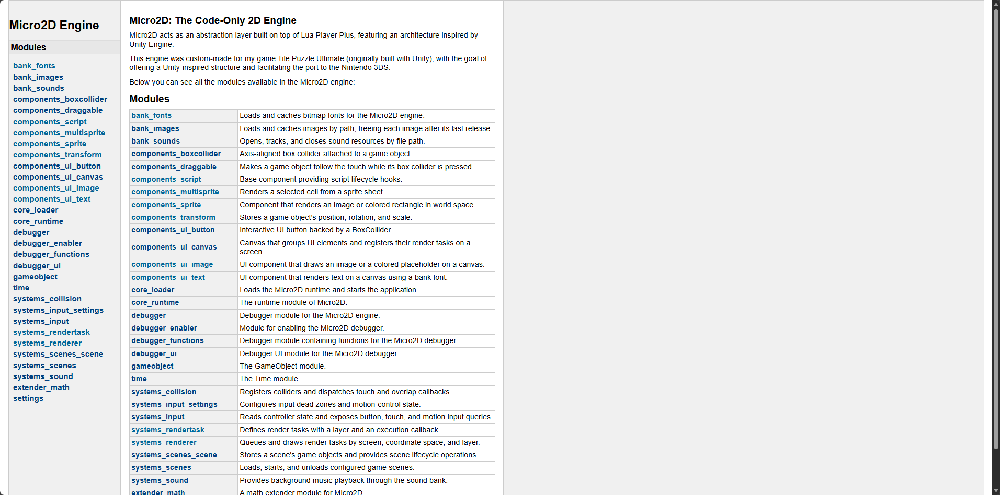
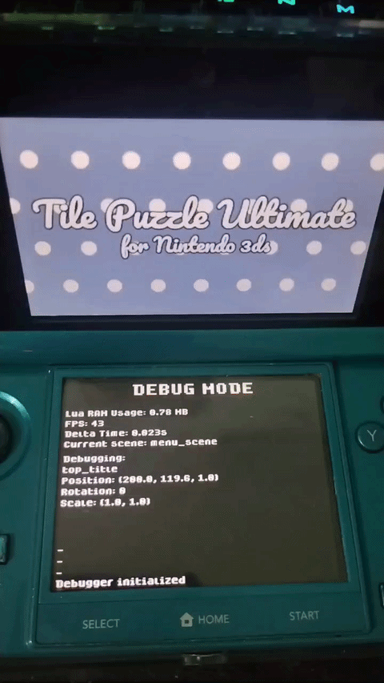

# Sobre o jogo Tile Puzzle Ultimate

<p align="center">
    
</p>

## Sumário

- [Origem](#origem)
  - [Como se detecta um puzzle impossível?](#como-se-detecta-um-puzzle-impossível)
  - [Depois da reprovação](#depois-da-reprovação)
- [Conceito de Homebrew](#conceito-de-homebrew)
- [Início do aprendizado do desenvolvimento para Nintendo 3DS](#início-do-aprendizado-do-desenvolvimento-para-nintendo-3ds)
  - [SH 3DS Info](#sh-3ds-info)
  - [Limitações presenciadas durante o desenvolvimento do SH 3DS Info](#limitações-presenciadas-durante-o-desenvolvimento-do-sh-3ds-info)
  - [Bitmap Font](#bitmap-font)
  - [BMFont2Lua](#bmfont2lua)
- [Criação do port do TPU para Nintendo 3DS](#criação-do-port-do-tpu-para-nintendo-3ds)
  - [Micro2D Engine](#micro2d-engine)
  - [Conclusão](#conclusão)

---

## Origem

O Tile Puzzle Ultimate, que chamarei de TPU, não foi uma ideia de jogo que se passou pela minha cabeça e na verdade ele originalmente foi de um teste para uma vaga que eu não consegui passar.

Em Novembro de 2024, eu havia me candidatado a uma vaga e o meu currículo foi um dos que foram chamados para o teste.

O teste consistia em fazer um jogo Tile Puzzle na Unity com base num conjunto de regras que eles tinham definido no documento. Documento este que, infelizmente não posso entrar em muitos detalhes por motivos de privacidade e que não me permitem compartilhar.

O teste teve a duração de uma semana e eu só fui capaz de concluir o jogo base na noite do último dia, pra ter a noção do quanto tempo levou, já que eu não tinha o dia todo livre.

Depois de um tempo eu recebi o feedback do que causou a reprovação, de forma resumida:

- **Teleporte da peça para o centro do mouse**
  - A peça centralizava no cursor no clique inicial.
  - Possível solução: Salvar a distância quando detectasse o clique para manter a distância relativa do ponteiro durante o arraste.

- **Restrição de eixos (Horizontal/Vertical)**
  - Esperavam limitação no movimento, não Drag and Drop.
  - A lógica validava os eixos apenas ao soltar a peça, enquanto o teste exigia o travamento dos eixos em tempo real durante o gesto.

- **Sobreposição e caixa**
  - Por causa do Drag and Drop, a peça se movia parcialmente livre (pois havia checagem depois).
  - O travamento dos eixos solucionaria isso.

São problemas tranquilos de resolver, o que aconteceu foi uma divergência de expectativa avaliador x desenvolvedor.

Havia uma situação que não foi descrita totalmente no teste, ele pedia que as peças fossem embaralhadas mas não tinha nenhuma especificação de que existia uma probabilidade de um embaralhamento puro gerar um puzzle impossível de se resolver. Você montava todo o puzzle e no final chegava com os números 7 e 8 com posições invertidas e não importa o quanto você mova, nunca vai conseguir resolver.

Tendo notado isso durante o desenvolvimento eu acabei dando um foco maior em garantir que sempre o jogo gerasse puzzles solucionáveis.

### Como se detecta um puzzle impossível

Nesse jogo existem as peças de 1 a 8, o puzzle é considerado impossível de resolver quando a quantidade de inversões existentes no puzzle é ímpar.

Uma inversão é contada quando uma peça com valor maior aparece antes de uma peça com valor menor na sequência do puzzle.
Por exemplo, dada a sequência 1, 3, 2, 5, 4, temos uma inversão entre 3 e 2 e uma inversão entre 5 e 4.

Segue abaixo o trecho do código do jogo na sua versão Unity, onde a função `GetInversionsCount` é responsável por contar as inversões no puzzle:

[Clique aqui para o código-fonte completo](https://github.com/Sharper-Dev/Open-Tile-Puzzle-Ultimate/blob/master/Assets/Scripts/Board/BoardPiecesShuffler.cs#L86)

```csharp
private int GetInversionsCount(int[] sequence)
{
    int inversionsCount = 0;
    for (int i = 0; i < sequence.Length - 1; i++)
    {
        for (int j = i + 1; j < sequence.Length; j++)
        {
            if (sequence[i] > 0 && sequence[j] > 0 && sequence[i] > sequence[j])
            {
                inversionsCount++;
            }
        }
    }
    return inversionsCount;
}

```

É possível notar também no código que há a condição de checar se a peça é maior que 0 antes de compará-la com outras peças. Isso porque o valor 0 representa a área vazia e não deve ser contada como uma peça para a verificação de inversões.

Na versão portada pro Nintendo 3DS usando Lua, o código ficou bem mais simplificado:

[Clique aqui para o código-fonte completo](https://github.com/Sharper-Dev/Tile-Puzzle-Ultimate-For-3DS/blob/master/src/assets/scripts/objects/board/board_shuffler_script.lua#L5)

```lua
local function getInversionsCount(pieces)
    local count = 0
    for i = 1, #pieces do
        for j = i + 1, #pieces do
            if pieces[i].number > pieces[j].number then
                count = count + 1
            end
        end
    end
    return count
end
```

A função em Lua dispensa a checagem de zero pois ela só recebe a tabela de peças como parâmetro, não uma sequência de números.

Depois das inversões serem contadas, o jogo verifica se o número de inversões é ímpar ou par, e se for par, ele é solucionável.

Para sabermos se um número é par, usamos o operador de módulo `%` que retorna o resto da divisão de um número por outro.

Um número é par se o resto da divisão por 2 for zero, ou seja, `number % 2 == 0`.

### Depois da reprovação

Após ter sido notificado e ter recebido o feedback, eu achei que seria um desperdício deixar o projeto de lado.

No final de 2024 até no início de 2025, eu trabalhei um pouco mais no jogo colocando alguns recursos e melhorias, sendo elas:

- Alguns puzzles com outras imagens
- Dificuldades diferentes exigindo um tempo mais rápido para resolver
- Músicas e efeitos sonoros compostos por mim
- Alguns efeitos visuais simples
- Um anúncio de banner usando o Google AdMob
- Publicação do jogo na Play Store, que se encontra disponível [aqui](https://play.google.com/store/apps/details?id=com.sharperdev.tilepuzzleultimatefor3ds)

Depois da publicação, acabei não criando mais nada ao longo de 2025 devido a algumas questões pessoais que exigiram meu tempo e atenção.

Com a chegada de 2026 e as coisas já estabilizadas, decidi retomar o projeto e ir um pouco mais além: portar o jogo para o meu console favorito, o Nintendo 3DS.

## Conceito de Homebrew

Homebrew é um software não oficial que é desenvolvido para rodar em consoles de videogame. Ele é criado por desenvolvedores independentes e entusiastas, muitas vezes com o objetivo de expandir as capacidades do console ou permitir a execução de aplicativos e jogos que não são oficialmente suportados pelo fabricante.

No caso dos consoles da Nintendo, a principal organização que fornece as ferramentas e recursos para o desenvolvimento de homebrew é a [devkitPro](https://devkitpro.org/), que oferece kits de desenvolvimento, bibliotecas e documentação para criar software para consoles como o Nintendo 3DS, Wii, GameCube, entre outros.

## Início do aprendizado do desenvolvimento para Nintendo 3DS

Quando eu quis fazer o port do jogo eu não queria dar um passo maior que a perna, a única linguagem que eu conhecia era apenas C# e eu não tinha experiência com C/C++ que é a linguagem usada e ideal para o desenvolvimento de homebrew.

Pesquisando um pouco eu encontrei um projeto do autor [Rinnegatamante](https://github.com/Rinnegatamante) chamado [Lua Player Plus](https://github.com/Rinnegatamante/lpp-3ds), descrito por ele como "Lua Player Plus é o primeiro interpretador Lua feito para o Nintendo 3DS.". Então decidi dar início a aprender a programar em Lua, já que ela é uma linguagem bem minimalista e bem presente em diversos jogos.

Vendo o tamanho do projeto eu percebi que pela quantidade de funções e recursos que tinha poderia ser o suficiente pra conseguir fazer boa parte do que eu planejava fazer sem eu precisar tocar em C/C++ por enquanto. A ideia era dar um passo simples e depois que eu tivesse mais experiência, eu poderia ir mais fundo e mexer em C/C++.

Só que nem tudo são flores, a última versão do projeto foi lançada em Fevereiro de 2016 e seu repositório arquivado em Outubro de 2022. Dado que isso esteja sendo escrito em 2026, são **DEZ ANOS** que o projeto não é atualizado, como consequência existem algumas limitações que tive que contornar, como por exemplo o módulo de Fontes que tirava muito desempenho e tive que criar outra maneira de desenhar textos na tela.

### SH 3DS Info



*SH 3DS Info rodando em um Nintendo 3DS real*

Antes de começar a desenvolver o port do TPU eu criei o [SH 3DS Info](https://github.com/Sharper-Dev/SH-3DS-Info), um pequeno homebrew que mostra as informações do console e também pode testar os controles e a tela touch.
Eu queria sentir como era desenvolver usando o Lua Player Plus e já vendo suas limitações antes mesmo de começar o projeto.

### Limitações presenciadas durante o desenvolvimento do SH 3DS Info

Vamos começar com a primeira limitação:

#### Documentação

Pra compararmos uma documentação comum, vamos usar de exemplo a documentação do framework Bootstrap, que é bem completa e detalhada, com exemplos de uso e explicações sobre cada função e recurso:



*Documentação do Bootstrap*

Pode-se observar que ela é bem detalhada e organizada, com exemplos de uso e explicações sobre cada função e recurso.

Agora vamos pra documentação do LPP:



*Documentação do Lua Player Plus*

Ela é uma documentação bem crua, apenas listando as funções e recursos disponíveis, sem explicações detalhadas.
Os únicos exemplos de uso que encontrei foram no próprio repositório do projeto.

A maneira de como precisei lidar com isso foi entendendo o que cada função fazia e testando na prática, também analisando projetos que usavam o LPP e vendo como eles faziam o uso das funções.

#### Modo de suspensão ao abrir/fechar console

Apesar de existirem funções que detectam se o console está aberto ou fechado, o homebrew não volta a rodar quando o console é aberto de novo, fazendo com que o usuário tenha que reiniciar o console para conseguir voltar a usar.

Infelizmente isso não é algo que eu consegui contornar, o usuário só não poderá fechar o console durante a execução do homebrew.

#### Ir para o menu HOME

O LPP possui uma função que permite ir para o menu HOME do console, mas ela não funciona como esperado.

Ao chamar a função, o console vai para o menu HOME mas quando você volta novamente, a biblioteca gráfica para de desenhar em ambas as telas e ficam totalmente pretas. Só continua desenhando se usar funções do módulo Screen, mas que não é o ideal a se usar para desenhar nas telas.

O LPP utiliza a biblioteca gráfica sf2d, mas que o ideal seria utilizar a biblioteca citro2d.

A maneira de contornar isso foi chamar diretamente a função de fechar a homebrew imediatamente quando o usuário apertasse o botão HOME, assim ele não teria problemas na hora de sair e voltar para o homebrew.

#### Módulo de Fontes

Ao tentar usar o módulo de Fontes do LPP, percebi que ele tirava muito desempenho do homebrew, presenciando quedas de FPS até mesmo no emulador com poucos textos na tela. Então decidi criar uma maneira de desenhar textos na tela sem precisar usar o módulo de Fontes: utilizar Bitmap Font.

#### Módulo de Som

Apesar do módulo de som funcionar, eu presenciei alguns problemas ao tocar sons de forma simultânea.

Isso foi mais presente no port do TPU, aonde eu tentei tocar efeitos sonoros e música ao mesmo tempo, mas o efeito sonoro tentava sobrescrever a música e tocando som de glitch. Então acabei optando apenas por tocar música no jogo, sem efeitos sonoros.

### Bitmap Font

Um Bitmap Font é uma fonte pré-renderizada armazenada em uma imagem Sprite Sheet, onde diversos caracteres ficam presentes em uma única imagem.

Segue abaixo o exemplo de um Bitmap Font, que é a fonte Dogica Pixel e pré-renderizei e usei como fonte padrão tanto pro SH 3DS Info quanto pro TPU:



*Sprite Sheet da fonte Dogica Pixel*

Além da imagem, é necessário também um arquivo de metadados que descreve a posição e tamanho de cada caractere na imagem, para que o algoritmo saiba como desenhar cada caractere corretamente. Nesse caso, quando utilizei o site SnowB, eu optei por gerar o arquivo em formato JSON.

#### Metadados do Bitmap Font

Focarei aqui apenas nos metadados mais importantes e responsáveis por descrever a posição e tamanho de cada caractere na imagem que estão presente no array "chars" do arquivo JSON:

```json
{
  "chars": [
    {
      "id": 32,
      "x": 0,
      "y": 0,
      "width": 32,
      "height": 39,
      "xoffset": 0,
      "yoffset": 0,
      "xadvance": 9,
    },
    ...
  ]
}
```
- **id**: O código UTF-8 (ou ASCII) do caractere. Por exemplo, o espaço tem o código 32, a letra 'A' tem o código 65, e assim por diante.
- **x** e **y**: As coordenadas do canto superior esquerdo do caractere na imagem Sprite Sheet.
- **width** e **height**: A largura e altura do caractere.
- **xoffset** e **yoffset**: O ajuste fino do cursor de desenho, que desloca ligeiramente na horizontal e vertical.
- **xadvance**: A distância pro cursor de desenho deslocar horizontalmente após desenhar o caractere, para que o próximo caractere seja desenhado na posição correta.

Com essas informações, eu implementei o seguinte algoritmo em Lua para desenhar textos na tela usando o Bitmap Font:

[Clique aqui para o código-fonte completo](https://github.com/Sharper-Dev/SH-3DS-Info/blob/master/romfs/scripts/modules/sh_canvas/shc_text.lua#L32)

```lua
function SHCText:_drawGPU()
    local cursor = { x = self.transform.position.x,
        y = self.transform.position.y }
    local font = SHCFonts.getFont(self.fontName)
    
    for _, lineContent in ipairs(self.contentLines) do
        for _, code in utf8.codes(lineContent) do
            local charInfo = font.data.chars[code]
            if charInfo then
                 Graphics.drawImageExtended(cursor.x + charInfo.xoffset,
                     math.floor(cursor.y) + charInfo.yoffset * self.transform.scale.y, charInfo.x, charInfo.y,
                     charInfo.width, charInfo.height,
                     self.transform.rotation,
                     self.transform.scale.x, self.transform.scale.y, font.sheet)
                cursor.x = cursor.x + charInfo.xadvance * self.transform.scale.x
            end
        end
        cursor.y = cursor.y + self.lineBreakDistance
        cursor.x = self.transform.position.x
    end
end
```

O algoritmo percorre cada linha de texto e cada caractere dentro da linha, obtendo as informações do caractere a partir dos metadados do Bitmap Font. Em seguida, ele desenha o caractere na tela usando a função `Graphics.drawImageExtended`, que consegue receber parâmetros para desenhar uma área específica da imagem e aplicando as transformações de posição, rotação e escala conforme necessário.

#### BMFont2Lua



*Screenshot da ferramenta BMFont2Lua rodando no Windows 10*

Para facilitar a utilização do Bitmap Font no homebrew, eu criei uma ferramenta chamada [BMFont2Lua](https://github.com/Sharper-Dev/BMFont2Lua).

Ela converte o arquivo de metadados JSON que foi previamente gerado para um formato de tabela Lua, que é mais fácil de ser utilizado no homebrew, dispensando um parser JSON e tornando o carregamento do arquivo mais rápido.

Além de que ele também reorganiza os dados para que tenha acesso direto às informações de cada caractere através do seu código UTF-8, sem precisar percorrer o array "chars" para encontrar o caractere desejado.

## Criação do port do TPU para Nintendo 3DS

Depois de ter finalizado o SH 3DS Info e ter aprendido a lidar com boa parte do LPP, decidi começar a colocar a mão na massa e portar o TPU para o Nintendo 3DS.

A Unity é uma mãe, ela te dá tudo que você precisa para desenvolver um jogo, vários sistemas pré-prontos pra implementar e usar. Mas no ecossistema homebrew isso não existe, você precisa criar boa parte do zero.

Dito isso:

### Micro2D Engine

Quando nós vamos desenvolver algum software, seja ele um jogo ou não, precisamos que as coisas fiquem minimamente organizadas e com cada coisa tendo sua responsabilidade, assim ninguém se perde no meio do caminho.

Nesse caso como o jogo original foi feito na Unity, sendo uma engine com uma estrutura bem validada pelo mercado, eu decidi criar uma micro engine apenas de código que se assemelhasse a Unity, mas que fosse bem mais simples e que suprisse as necessidades do TPU, e assim surgiu a Micro2D.

Totalmente escrita em lua, ela permitiu que eu separasse o que é coisa de jogo e o que é coisa de engine.

Primeiro criei a base da Micro2D, e quando ela teve uma base minimamente boa, eu comecei a portar o TPU.

A cada recurso que eu precisava, como por exemplo: "agora vou precisar de um botão", eu criava o recurso na Micro2D e depois implementava no TPU.



*Documentação da Micro2D Engine gerada via LDoc*

*Hospedada em: [https://sharper.dev.br/Micro2D-Engine/](https://sharper.dev.br/Micro2D-Engine/)*

#### Visão Geral da Micro2D Engine

A Micro2D possui os seguintes recursos:

#### 1. Núcleo e Arquitetura
- **Game Object**: Representa um objeto no jogo, podendo ter múltiplos componentes anexados a ele.
- **Sistema de Cenas**: Permite a criação e gerenciamento de diferentes cenas do jogo, com a possibilidade de alternar entre elas.
- **Bancos de fontes, imagens e sons**: Permite o carregamento e gerenciamento de recursos de forma centralizada, evitando duplicação e facilitando o acesso aos recursos.

#### 2. Componentes Principais
- **Componente Transform**: Presente em todos os objetos, permite definir a posição, rotação e escala do objeto. (O sistema de hierarquia não foi implementado, então não há herança de transformações entre objetos)
- **Componente Sprite**: Adiciona ao objeto a capacidade de ter um sprite renderizado na tela.
- **Componente MultiSprite**: Permite que o objeto tenha múltiplos sprites usando um Sprite Sheet, podendo escolher com base no tamanho da célula (em pixels) e suas coordenadas.
- **Componente Script**: Semelhante ao MonoBehaviour da Unity, permite que scripts sejam anexados aos objetos para definir seu comportamento, com Start e Update.

#### 3. Interface de Usuário (UI)
- **Componente Canvas**: Responsável por gerenciar os elementos de UI, também podendo alternar entre as telas superior e inferior do console.
- **Componente Text**: Permite que textos sejam renderizados na tela, utilizando Bitmap Font.
- **Componente Button**: Permite a funcionalidade de um botão, usando o componente BoxCollider pra detectar o touch.
- **Componente Image**: Permite que imagens sejam renderizadas no canvas.

#### 4. Sistemas, Física e Input
- **Sistema de Input**: Permite a detecção de entradas do usuário, como toques na tela e pressionamento de botões.
- **Sistema de Colisão**: Gerencia a detecção de colisões entre os objetos com BoxCollider, permitindo que o jogo reaja a essas colisões. Usando majoritariamente o algoritmo de AABB (Axis-Aligned Bounding Box), que é eficiente para colisões retangulares.
  - **Componente BoxCollider**: Permite a detecção de colisão entre os objetos e de interação com a tela touch.
  - **Componente Draggable**: Permite que os objetos sejam arrastados pela tela touch.
- **Sistema de Renderização**: Gerencia a renderização dos objetos na tela baseada em alocação de fila de Render Tasks, garantindo que eles sejam desenhados na ordem correta com base no seu eixo Z (profundidade), além de separar a renderização de espaço de jogo e espaço de tela.
- **Sistema de Som**: Gerencia a reprodução músicas no jogo, mas sem suporte a efeitos sonoros devido a limitação do LPP.

#### 5. Utilitários e Ferramentas
- **Time**: Fornece o deltaTime.
- **Extensor da math**: Adiciona funções matemáticas adicionais, como interpolação linear e checagens de AABB.
- **Debugger**: Permite a exibição de informações de depuração na tela, como FPS, uso de memória, cena atual, mensagens de console e capacidade de mover objetos.



*Debugger da Micro2D ativado em um Nintendo 3DS real*

Com todos esses recursos, foi o suficiente para facilitar o port do TPU para o Nintendo 3DS.

### Conclusão

Foi muito satisfatório ver o jogo rodando no console, mesmo com todas as dores de cabeça que tive que passar.

Cheguei no ponto que consegui extrair bastante do projeto LPP que já me sinto preparado pra avançar pro C/C++, assim no futuro quem sabe eu posso refazer o port totalmente melhorado e sem capar os recursos por conta do LPP?

Se você chegou até aqui, agradeço o seu tempo pela leitura e espero que eu tenha desmistificado um pouco como as coisas funcionam por baixo dos panos.